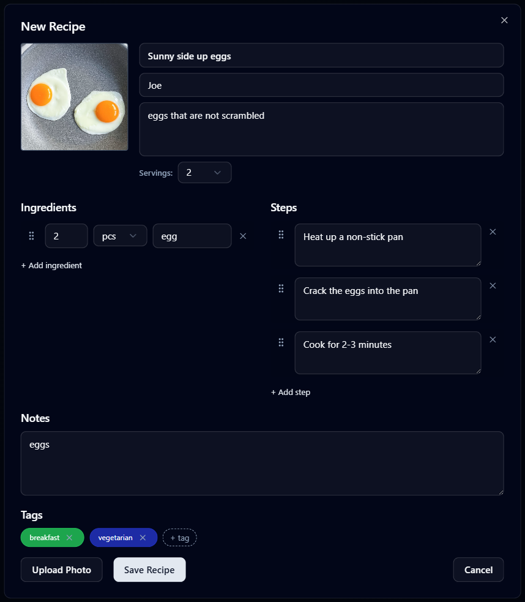

# Digital Cookbook

Digital Cookbook is a full-stack recipe manager built with **Bun + React + Vite + Elysia + SQLite**. It’s intentionally scoped for in-home/local use—no auth, multi-user handling, or hosted deployment flows. If you want to run it publicly you’d need to design user management, auth, and more robust persistence before exposing it online.

## Tech Stack
- **Frontend:** React 19, TypeScript, Vite, Tailwind, shadcn.
- **Backend:** Elysia (Bun) with the `bun:sqlite` driver storing data in `data/cookbook.db` (WAL + foreign keys enabled).
- **Tooling:** Bun scripts for dev/build/test, ESLint, Fuse.js for fuzzy search, custom FLIP animation hook.

## Highlighted Features
- Multiple cookbooks with inline rename/delete and confirmation flows.
- Rich recipe cards with photos, servings scaling, drag-and-drop ingredient/step reordering.
- Tag-based filtering (AND/OR), debounced search, and animated grid transitions.
- Likes, tags, and cook-count tracking.
- Optional experimental WASM SQLite layer (`src/lib/db.ts`) for potential offline/local extensions.

## Features
### Add & curate recipes
Create recipes with photos, author notes, ingredient quantities, ordered steps, tags, and optional rich notes—all inside a single dialog that handles uploads and validation.



### Powerful sorting options
Switch between alphabetical (A→Z / Z→A) and “Most cooked” sorting so the list surfaces favorites or keeps things organized by title.

### Tag filtering modes
Filter recipes with AND/OR logic to narrow down to exact tag combinations or quickly browse anything matching a tag set.

### Ingredient scaling per serving
Adjust servings directly on the recipe card; ingredient quantities recalculate on the fly so shopping lists always match the desired portion size.

### Debounced search & animations
Typing in the search bar triggers a 200 ms debounced fuzzy lookup with Fuse.js, while the recipe grid animates insertions/removals using FLIP-based transitions.

### Engagement tracking
Recipes track likes and usage counts, with optimistic UI updates to keep interactions feeling instant.

## Project Structure
```
.
├─ server/            # Elysia API + SQLite schema/queries
├─ src/
│  ├─ components/    # Feature components (RecipeCard, sidebar, etc.)
│  ├─ components/ui/ # Design-system primitives (Radix wrappers/shadcn style)
│  ├─ hooks/         # Reusable hooks (e.g., useFlipList)
│  ├─ lib/           # API client, experimental sql.js DB, helpers
│  └─ types/         # Ambient declarations
├─ data/cookbook.db  # SQLite database (auto-created, safe to delete for reset)
├─ AGENTS.md         # AI/maintainer instructions and conventions
```

## Prerequisites
- [Bun](https://bun.sh/) v1.1+
- Node-compatible environment (used for tooling via Bun)

> **Note:** Always use `bun` instead of `npm`/`yarn`, and when running PowerShell commands include `-NoLogo -NoProfile` (mirrors automation rules in `AGENTS.md`).

## Quickstart
```bash
# Install dependencies
bun install

# Start API + Vite dev servers concurrently (API:4000, Vite:5173)
bun run dev:full

# Run only the API server
bun run server

# Run only the Vite dev server
bun run dev
```

Visit `http://localhost:5173` and interact with the UI; `/api/*` calls proxy to `http://localhost:4000` via Vite.

## Additional Scripts
```bash
# Lint the project
bun run lint

# Execute tests (Bun test + happy-dom)
bun run test

# Production build (type-check + Vite build)
bun run build

# Preview built frontend (still requires API server separately)
bun run preview
```

## Backend Overview
- `server/index.ts` boots the Bun SQLite DB (WAL + FK) and defines routes such as:
  - `GET /api/cookbooks`, `POST /api/cookbooks`, `PATCH/DELETE /api/cookbooks/:id`
  - `GET /api/recipes?cookbookId=…`, `GET /api/recipes/search`
  - `GET /api/recipes/:id`, `POST /api/recipes`, `PATCH /api/recipes/:id`, `DELETE /api/recipes/:id`
  - Tag & like helpers (`POST/DELETE /api/recipes/:id/tags|likes`)
  - Usage counter actions (`POST /api/recipes/:id/increment-uses`, `/decrement-uses`)
- Multi-step mutations run inside `db.transaction` calls and follow a “delete & replace” pattern for ordered lists (ingredients, steps, notes) to preserve deterministic ordering.

## Frontend Interaction Patterns
- All network requests go through `src/lib/api.ts`. Add new endpoints here first, then wire components.
- Parents expose a `reload` handler; children (`RecipeCard`, `RecipeCreateCard`) call it after any mutation.
- Search is debounced by 200 ms inside `App.tsx`; tag filtering supports AND/OR modes.
- Theme toggling persists via `localStorage` + a root `dark` class; there’s no context provider.
- Design-system primitives in `src/components/ui/*` should remain untouched unless updating global styles (keep overrides in feature components instead).

## Working Notes
- Need to reset the DB? Delete `data/cookbook.db` and restart; the server reseeds a default cookbook automatically.

Happy cooking! 🍳
